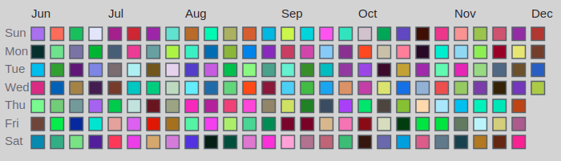
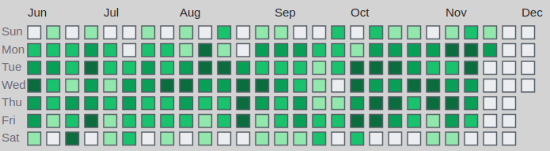

# Day Calendar with Github like heatmap

Simple Generator for Github style Calendar with Month/Week/Days grid.

Command line utility Class to generate index.html with SVG grid

## Prerequisite

1. sbt [https://www.scala-sbt.org/](https://www.scala-sbt.org/)


## Build
```
sbt assembly
```

### HTML output Examples

When run it generates index.html file with styles in __daygrad.css__

1. Random Colors

```
# day-grad.sh rand
```



2. Git log

```
# git-grad.sh ./
```



Visualization can be customized with

```
# git-grad.sh [repository] [past] [max] [min]
```

__past__ - how many months to go into the past

__max__  - upper bound for changes maximum gradient (dark color)

__min__  - lower bound for changes minimum gradient (light color)


